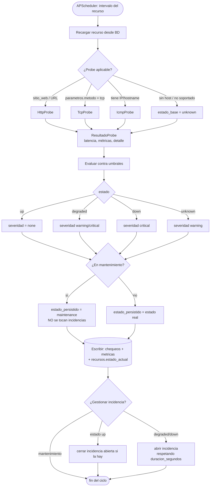

# Flujo de un ciclo de chequeo (workers de monitoreo)

> FASE 3: probes **ICMP**, **HTTP/HTTPS** y **TCP**. SNMP / Starlink (gRPC) /
> Fortinet API quedan para 3b. Implementado en [monitor/](../monitor/).

## Visión general

APScheduler dispara, por cada recurso activo y según su `intervalo_segundos`,
la función `ejecutar_chequeo_por_id`. Cada disparo recarga la config del recurso
desde la BD (para tomar cambios sin reiniciar), ejecuta el probe, evalúa el
estado contra los umbrales, persiste el resultado y gestiona la incidencia.

## Detalle paso a paso (un ciclo)

1. **Disparo** — APScheduler ejecuta el job `recurso:{id}` según su intervalo
   (`max_instances=1`, `coalesce=True`: nunca dos chequeos solapados del mismo
   recurso). Ver [scheduler.py](../monitor/monitor/scheduler.py).
2. **Recarga** — `cargar_recurso(id)` trae config fresca (host, parámetros,
   intervalo, tipo, protocolo).
3. **Selección de probe** ([probes/\_\_init\_\_.py](../monitor/monitor/probes/__init__.py)):
   - `sitio_web` o URL `http(s)://` → **HttpProbe**
   - `parametros.metodo == "tcp"` → **TcpProbe**
   - cualquier recurso con IP/hostname → **IcmpProbe** (cobertura general; incluye
     los que en 3b usarán SNMP/Starlink)
   - sin host → sin probe → `unknown`.
4. **Secretos** — si el probe lo requiere (HTTP con basic-auth/api_key), se
   descifran con `descifrar_secreto(secretos, APP_CRYPTO_KEY)` — **la misma
   función pgcrypto que usa la API**. La clave vive solo en el `.env` del worker.
5. **Ejecución del probe** → `ResultadoProbe`:
   - **ICMP**: `latency` (ms), `loss` (%); `up` si responde, `down` si 100% pérdida.
   - **HTTP**: `latency`, `http_status`, `ssl_dias_restantes`; `down` si no conecta
     o el status ≠ esperado (o falta `match_text`).
   - **TCP**: `latency`; `up` si el puerto acepta conexión, `down` si no.
6. **Evaluación** ([evaluacion.py](../monitor/monitor/evaluacion.py), lógica pura):
   - `down` → estado `down`, severidad `critical`.
   - `unknown` → estado `unknown`, severidad `warning`.
   - `up` + métrica sobre umbral **crítico** → `degraded` / `critical`.
   - `up` + métrica sobre umbral **warning** → `degraded` / `warning`.
   - `up` sin superar umbrales → `up`.
   - Umbral específico de recurso prevalece sobre el de tipo.
7. **Mantenimiento** — si hay ventana activa en `mantenimientos` (por recurso,
   por sitio o global), el estado persistido pasa a `maintenance` y **no se abre
   ni cierra ninguna incidencia** (alertas silenciadas). Las métricas sí se guardan.
8. **Persistencia** — `INSERT` en `chequeos` (estado, latencia, `detalle` jsonb con
   la evaluación), `INSERT` de `metricas` (serie temporal), y `UPDATE` de
   `recursos.estado_actual` + `ultimo_chequeo_at`.
9. **Incidencias** (si no hay mantenimiento) — máquina de estados:
   - estado `up` y había incidencia abierta → se **resuelve** (recuperación).
   - estado `down` → abre incidencia `critical` **de inmediato**.
   - estado `degraded` → abre incidencia respetando `duracion_segundos`
     (anti-flapping: solo si la racha sin `up` supera esa duración).
   - ya abierta → actualiza severidad si cambió.
   - Garantía de “una incidencia abierta por recurso” por índice único parcial
     en la BD (`uq_incidencia_abierta`).

## Tareas internas (además de los chequeos)

- **Resync de jobs** cada `SYNC_INTERVAL_SEG`: altas/bajas/cambios de intervalo.
- **Mantenimiento de datos** (si `TAREAS_MANTENIMIENTO=true`): `fn_rollup_metricas_horario`
  (min 5 de cada hora), `fn_rollup_metricas_diario` (00:15), `fn_purgar_datos`
  (03:30), y creación anticipada de la partición del mes siguiente (día 25).
- **/health** opcional en `:8090` (estado del worker + ping a la BD).
