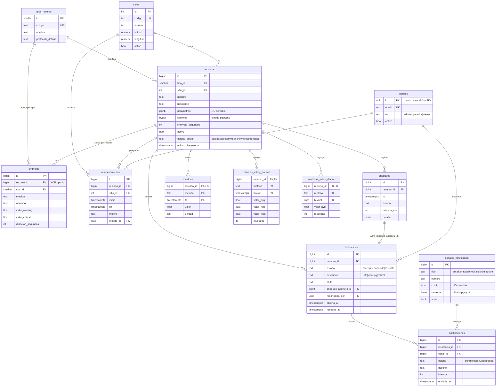
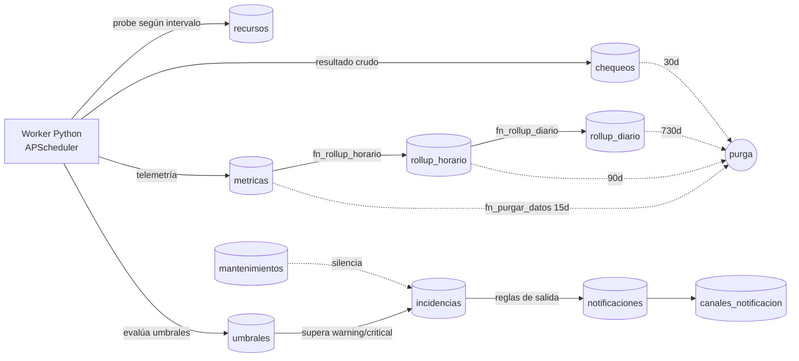

# Modelo lógico de datos — Sistema de Monitoreo de Disponibilidad de TI

> Generado en FASE 1. Refleja `db/migrations/0001_init.up.sql` y
> `db/migrations/0002_timeseries.up.sql`.

## Diagrama entidad-relación (mermaid)

## Flujo de datos (cómo se llena el modelo)

## Notas de diseño

- **Capas separadas (CLAUDE.md):** la BD no contiene lógica de Supabase. `perfiles.id`
  es un `uuid` que coincide con `auth.users.id`, pero **sin FK** → portable a Postgres puro.
- **Cifrado:** `parametros` (jsonb, claro) vs `secretos` (bytea, cifrado pgcrypto AES-256).
  La clave maestra vive en la API, nunca en la BD. Ver `db/README.md`.
- **Serie temporal:** `metricas` particionada por mes (RANGE nativo, sin TimescaleDB),
  indexada por `(recurso_id, metrica, ts)` para consultas por rango.
- **Retención escalonada:** crudo 15d → horario 90d → diario 730d; chequeos 30d.
- **Estados:** `up | degraded | down | unknown | maintenance`.
- **Una incidencia abierta por (recurso, interfaz)** garantizada por índice único parcial
  `uq_incidencia_abierta` sobre `(recurso_id, COALESCE(if_index, -1)) WHERE estado <> 'resuelta'`.
  La incidencia "del recurso" usa `if_index NULL`; las de interfaz llevan su `if_index`.

## Tablas y columnas añadidas (mejoras de operación)

Migraciones 0004–0007 (ver `db/migrations/` y `docs/funcionalidades-avanzadas.md`):

- **0004 `interfaces`** — snapshot por puerto (IF-MIB): `oper_estado`, `admin_estado`,
  `in_mbps`/`out_mbps`, `util_*`, `*_err`, `speed_mbps`. PK `(recurso_id, if_index)`.
- **0005 `recursos.depende_de_id`** — self-FK para dependencias padre→hijo (supresión de alertas).
- **0006 `auditoria`** — bitácora: `perfil_id`, `actor_email/rol`, `accion`, `entidad`,
  `entidad_id`, `cambios` (jsonb diff), `ip`.
- **0007** — `interfaces_historico` (serie temporal de Mbps por puerto, retención 7d),
  `interfaces.monitorear` (alertar si cae), e `incidencias.if_index`/`if_nombre` (incidencias por interfaz).

> El catálogo de estados y la política de retención son **propuestas** de esta
> fase: la sección correspondiente de `CLAUDE.md` estaba vacía.
